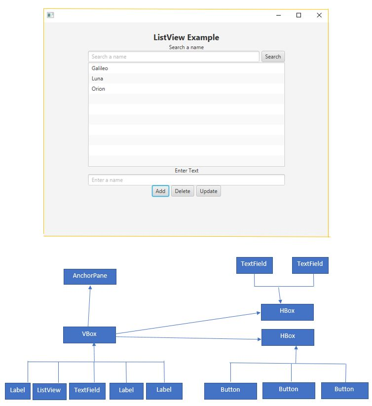
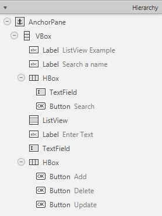
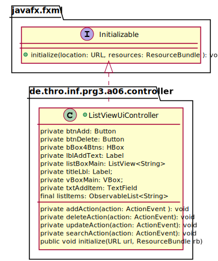

_This is an assignment to the class [Advanced Programming](https://hsro-inf-fpk.github.io) at the [University of
Applied Sciences Rosenheim](http://www.th-rosenheim.de)._

# Assignment 6: GUI introduction in JavaFx

This exercise aims to help you design a simple GUI using JavaFX. A detailed introduction to GUI programming 
is then given in the "Graphical User Interface" section (FWPM).<br>

Design a GUI application as shown in the following illustration. The application consists of a View, Controller, and Model(Person).<br>
This is an MVC Pattern, which stands for _Model-View-Controller Pattern_. This pattern is used to separate the application's concerns:
- Model - Model represents an object or Java POJO carrying data.
- View - View represents the visualization of the data that the model contains.
- Controller - The controller acts on both model and view. It controls the data flow into the model object and updates the view whenever data changes. It keeps the view and model separate.

The model will be the `Person` which is already given. The `ListViewUi.fxml` will build the user interface for JavaFX applications, this is the scene and `ListViewUiController`ListViewUiController is the controller class responsible to store data in the Person object and update view `ListViewUi.fxml` accordingly.

View (controller class: ListViewUiController.java) is used to initialize the program. In this view, the user will type a text below (Enter Text Label) and:
- on the Save button will save the data into the `LisView`.
- on delete button, we want to delete the selected data from `LisView`.
- on update button, we want the selected data to be changed. 
- on the search button we search for Person names, and we show the result in `LisView`.<br><br>

Create the given GUI components in the GUI Builder Scene Builder and proceed in the following step-by-step. 



## Setup

1. Create a fork of this repository (button in the right upper corner) (if you want to)
2. Clone the project (get the link by clicking the green _Clone or download button_)
3. Import the project to your IntelliJ.
4. Now install Scene Builder
  - Normally, IntelliJ will do automatically
  - if not, you can get it from here: http://gluonhq.com/open-source/scene-builder/; integrate Scene Builder in IntelliJ by setting the path to SceneBuilder.exe  <br> _"File" → "Settings" → "Languages & Frameworks" → Java FX"_

## Task 1: Design the GUI with Scene Builder

1. Let’s create an FXML file `ListViewUi.fxml` Store the file in the resources/ directory where the resources 
directory will be included in the CLASSPATH for the application. To design the respective view with Scene Builder, 
you simply have to right-click on * .fxml in the project window and select "Open in Scene Builder". Scene Builder then starts.

2. Now design the GUI according to the specifications in the illustration! The individual components and the layout manager can be added and arranged using drag and drop.
Check-in Scene Builder in the hierarchy view on the left that your Scene Graph complies with the specification.<br>
_Hint:_<br>



## Task 2: View



1. Create a new, empty Java class `ListViewUiController.java` accordingly to UML.
2. Link this `ListViewUiController.java` with the FXML file by setting the fx: controller attribute in the FXML file.
3. The controller is instantiated by the FXML loader. The FXML loader will automatically look for accessible instance variables of the controller. 
If the name of an accessible instance variable matches the fx:id attribute of an element, the object reference from FXML is automatically copied into the 
controller instance variable. This feature makes the references of UI elements in FXML available to the controller. The controller can use them later, 
such as binding them to the model so now assign the right fx-id to all components `TextField, VBoxMain, Label, ListView, and all Buttons ...`
4. The controller can have an accessible initialize() method, which should take no arguments and have a return type of void. The FXML loader will call 
the `initialize()` method after the loading of the FXML document is complete. In our case, the ListView of the `ListViewUiController.java` must be instantiated. 
When the ListView constructor is called, an empty, "observable" list must be passed as a parameter, we do this in `initialize()` method. 
Changes to this list are applied directly to the graphical user interface. You can create an empty, "observable" list as follows: `FXCollections.observableArrayList()`.
5. Implement the `addAction(), deleteAction(), updateAction(),` methods.<br>
_Hint:_<br>
`TextField ` with `getText()` you can access the entered data; Example: `new Person(getText())`;<br>
`ObservableList<Person>` we clear the list with clear(), with `add(...)` add Persons or remove with `remove(...)` ;<br>
`ListView`  displays vertically the items from which the user may select, or with which the user may interact.<br>
with `int selectedItem = listViewBox.getSelectionModel().getSelectedIndex() ` if ` > -1` item in der ListView has been selected. With `setItems(...)`
sets the underlying data model for the ListView.
_Optional_
6. For the implementation of searchAction() to search for a Person's name is a Long-running operation and Long-running operations must not be run on the JavaFX application thread since this prevents
JavaFX from updating the UI, resulting in a frozen UI. Furthermore, any change to a Node that is part of a "live" scene graph must happen on the JavaFX application thread. 
Platform.runLater can be used to execute those updates on the JavaFX application thread.<br>
_Example of `ProgressBar` with  `Platform.runLater(...)` for orientierung _<br>
```java
public class ControllerProgressBar implements Initializable {
  
    ...
  
  void doUpdate() {
    Thread taskThread = new Thread(new Runnable() {
      @Override
      public void run() {
        for (double i = 10; i >= 1; i--) {
          try {
            Thread.sleep(1000);
          } catch (InterruptedException e) {
            e.printStackTrace();
          }
          final double value = i;
          Platform.runLater(new Runnable() {
            @Override
            public void run() {
              progressBar.setProgress(1 / value);
            }
          });
        }
      }
    });
    taskThread.setDaemon(true);
    taskThread.start();
  }
  
  ...
  
}
```
